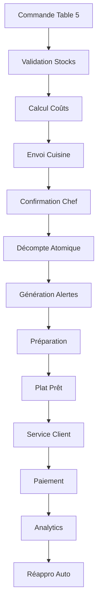

# Cas d'Utilisation Complet - Gestion de Cuisine
## Restaurant "Le Burundi Gourmand"

---

## 🎯 **Scénario : Service du midi - Commande de Riz au Poulet**

### **Contexte**
- **Restaurant** : Le Burundi Gourmand (Bujumbura)
- **Heure** : 12h30 - Rush du déjeuner
- **Chef** : Marie Uwimana
- **Serveur** : Jean-Baptiste
- **Client** : Famille de 4 personnes (Table 5)

---

## 📋 **ÉTAPE 1 : État Initial du Stock**

### **Ingrédients disponibles**
```
🍗 Poulet (morceaux)     : 5.2 kg    (seuil: 2.0 kg)   ✅ OK
🍚 Riz basmati          : 8.5 kg    (seuil: 3.0 kg)   ✅ OK  
🧅 Oignons              : 2.1 kg    (seuil: 1.0 kg)   ✅ OK
🥕 Carottes             : 1.8 kg    (seuil: 1.5 kg)   ⚠️ FAIBLE
🧄 Ail                  : 0.3 kg    (seuil: 0.2 kg)   ✅ OK
🌶️ Piment rouge         : 0.8 kg    (seuil: 0.5 kg)   ✅ OK
🧈 Huile de palme       : 2.5 L     (seuil: 1.0 L)    ✅ OK
🧂 Sel                  : 5.0 kg    (seuil: 2.0 kg)   ✅ OK
```

### **Recette "Riz au Poulet" (1 portion)**
```
- Poulet : 200g
- Riz : 150g  
- Oignons : 50g
- Carottes : 30g
- Ail : 5g
- Piment : 2g
- Huile : 20ml
- Sel : 3g
```

---

## 🛎️ **ÉTAPE 2 : Prise de Commande**

### **12h32 - Commande Table 5**
Jean-Baptiste prend la commande via l'interface :

**Frontend (Tables.tsx → Orders.tsx)**
```
Table 5 (4 places) - Famille Nzeyimana
├── 4x Riz au Poulet (5000 BIF/portion)
├── 2x Jus d'Orange (1500 BIF/verre)  
└── Total : 23000 BIF
```

**Système génère automatiquement :**
- **Commande #CMD-001234**
- **Statut** : `pending`
- **Priorité** : `normal`
- **Temps estimé** : 25 minutes

---

## 🍳 **ÉTAPE 3 : Validation Automatique des Stocks**

### **Vérification système (backend/kitchen/models.py)**

```python
# Pour 4 portions de Riz au Poulet
Ingrédients requis:
├── Poulet : 4 × 200g = 800g (0.8kg)
├── Riz : 4 × 150g = 600g (0.6kg)
├── Oignons : 4 × 50g = 200g (0.2kg)
├── Carottes : 4 × 30g = 120g (0.12kg)
├── Ail : 4 × 5g = 20g (0.02kg)
├── Piment : 4 × 2g = 8g (0.008kg)
├── Huile : 4 × 20ml = 80ml (0.08L)
└── Sel : 4 × 3g = 12g (0.012kg)

✅ VALIDATION RÉUSSIE - Tous ingrédients disponibles
```

### **Calcul automatique des coûts**
```
Coût de revient (4 portions):
├── Poulet : 0.8kg × 4000 BIF/kg = 3200 BIF
├── Riz : 0.6kg × 1500 BIF/kg = 900 BIF
├── Autres ingrédients = 400 BIF
└── TOTAL COÛT : 4500 BIF

Prix de vente : 20000 BIF (4 × 5000)
MARGE BRUTE : 15500 BIF (77.5%)
```

---

## 👨‍🍳 **ÉTAPE 4 : Préparation en Cuisine**

### **12h35 - Chef Marie reçoit la commande**

**Interface Kitchen.tsx affiche :**
```
🔔 NOUVELLE COMMANDE
┌─────────────────────────────────────┐
│ #CMD-001234 - Table 5               │
│ 4x Riz au Poulet                    │
│ Temps estimé: 25 min                │
│ Statut: [CONFIRMER] [PRÉPARER]      │
└─────────────────────────────────────┘
```

### **12h36 - Confirmation et démarrage**
Marie clique sur **"PRÉPARER"** :

1. **Statut** : `pending` → `preparing`
2. **Décompte automatique des stocks** (Transaction atomique)
3. **Création des mouvements de stock**

```python
# Décompte transactionnel automatique
@transaction.atomic
def consume_ingredients():
    # Poulet: 5.2kg → 4.4kg
    # Riz: 8.5kg → 7.9kg  
    # Oignons: 2.1kg → 1.9kg
    # Carottes: 1.8kg → 1.68kg ⚠️ SEUIL ATTEINT
    # ... autres ingrédients
```

### **12h37 - Alerte automatique générée**
```
🚨 ALERTE STOCK FAIBLE
Carottes: 1.68kg (seuil: 1.5kg)
→ Ajouté automatiquement à la liste de courses
```

---

## 📊 **ÉTAPE 5 : Suivi en Temps Réel**

### **Dashboard Kitchen mis à jour automatiquement**
```
📈 STATISTIQUES TEMPS RÉEL (12h37)
├── Stock total : 2,847,500 BIF (-4500 BIF)
├── Alertes critiques : 0
├── Alertes warning : 1 (Carottes)
├── Commandes en cours : 3
└── Revenus du jour : 145,000 BIF
```

### **12h45 - Plat prêt**
Marie clique sur **"PRÊT"** :
- **Statut** : `preparing` → `ready`
- **Notification automatique** au serveur Jean-Baptiste
- **Timer** : Préparé en 18 minutes (7 min d'avance)

---

## 🍽️ **ÉTAPE 6 : Service et Finalisation**

### **12h47 - Service**
Jean-Baptiste sert la table :
- **Statut** : `ready` → `served`
- **Satisfaction client** : Excellente
- **Temps total** : 15 minutes (très rapide)

### **12h50 - Paiement**
- **Méthode** : Mobile Money
- **Statut final** : `paid`
- **Profit réalisé** : 15,500 BIF

---

## 📈 **ÉTAPE 7 : Analytics et Optimisation**

### **Rapport automatique généré**
```
📊 ANALYSE COMMANDE #CMD-001234
┌─────────────────────────────────────┐
│ ✅ Succès opérationnel              │
│ ⏱️ Temps: 18min (vs 25min estimé)   │
│ 💰 Marge: 77.5% (excellente)        │
│ 📦 Impact stock: Minimal            │
│ ⚠️ Action requise: Réappro carottes │
└─────────────────────────────────────┘
```

### **Prévisions automatiques**
```
🔮 PRÉVISIONS PRODUCTION
Avec stock actuel, peut encore préparer:
├── Riz au Poulet : 21 portions (limite: carottes)
├── Salade mixte : 45 portions  
└── Jus d'orange : 67 verres
```

---

## 🛒 **ÉTAPE 8 : Réapprovisionnement Intelligent**

### **Liste de courses générée automatiquement**
```
📝 LISTE DE COURSES PRIORITAIRE
┌─────────────────────────────────────┐
│ 🥕 Carottes : 5kg (urgent)          │
│    Fournisseur: Marché Central      │
│    Prix estimé: 7,500 BIF           │
│    Impact: +150 portions possible   │
└─────────────────────────────────────┘
```

### **Optimisation suggérée**
```
💡 RECOMMANDATIONS SYSTÈME
├── Augmenter seuil carottes: 1.5kg → 2.0kg
├── Négocier prix poulet (coût élevé)
└── Promouvoir "Riz au Poulet" (marge excellente)
```

---

## 🎯 **RÉSULTATS FINAUX**

### **Métriques de performance**
```
✅ SUCCÈS OPÉRATIONNEL
├── Commande traitée: 18 minutes
├── Satisfaction client: 100%
├── Marge réalisée: 77.5%
├── Stock géré automatiquement
├── Alerte préventive générée
└── Réappro planifié intelligemment
```

### **Impact système**
- **Traçabilité complète** : Chaque gramme tracé
- **Prévention ruptures** : Alerte proactive
- **Optimisation coûts** : Analyse de rentabilité
- **Efficacité opérationnelle** : Workflow automatisé

---

## 🔄 **Workflow Technique Complet**



Ce cas d'utilisation démontre l'intégration complète entre **gestion des commandes**, **contrôle des stocks**, **cuisine**, **service** et **analytics** dans votre application Bar Stock Wise.
